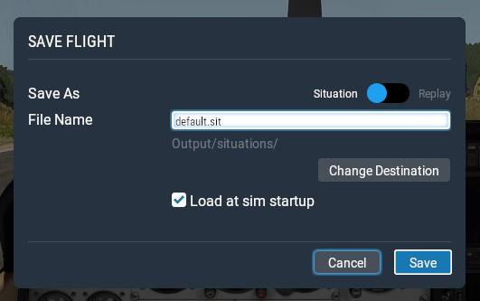

= Usage

. The first time you start the application (after configuration) the aircraft list will be empty, as no aircraft has yet been flown
. Manually start the sim and start a flight as you would normaly do
. Save this flight as "default.sit" in the default location "Output/situations" and check "Load at sim startup". Also set the sim to skip the main menu on startup if you want to directly hop into the plane.
+

+
(Thanks to https://forums.x-plane.org/index.php?/profile/624270-pep-peroni/[@Pep Peroni] for the screen 😉
+
. After closing the sim hit "refresh" in the app and you should see the last flown aircraft
. Goto 2 and repeat if you want more aircrafts to be shown in the app. Instead of manually starting the sim you can also start through the launcher and change flight settings afterwards.
. Select an aircraft from the list or map and klick "start". The sim will start with the selected aircraft/location 